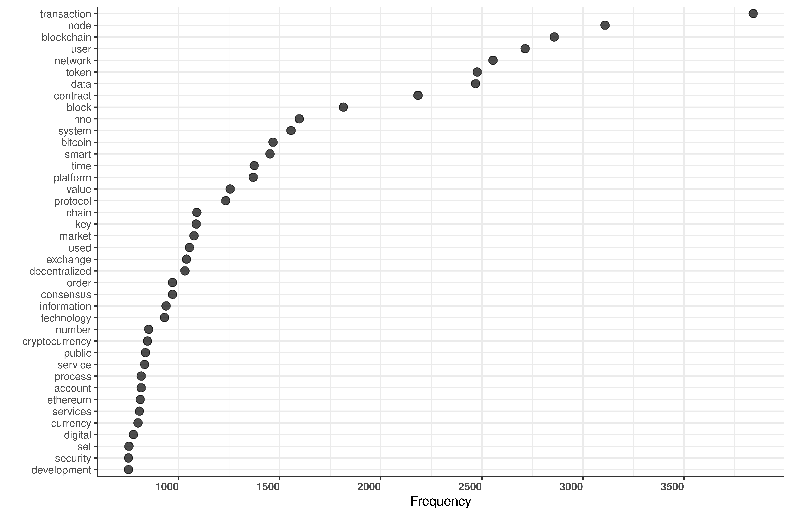
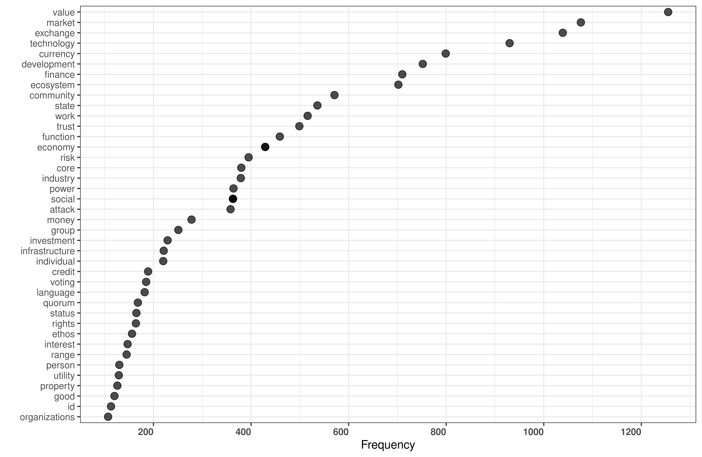

# White Papers of Top 100 Cryptocurrencies and Their Blockchains

**Reference:** Caliskan, K. and Birbil, S.I. (2020). White papers of
top 100 Cryptocurrencies and their Blockchains. GitHub Repository
https://github.com/sibirbil/DataMoney

These data present all text content of the white papers of most
valuable 100 cryptocurrencies as of 1 June 2018, except those of the
Digibyte, Dogecoin, GAS, Huobi Token and Monacoin, cryptocurrencies
that were offered without a white paper. The white papers are gathered
form the websites of the following cryptocurrencies: Aelf, Aeternity,
Aion, Allsports, Ardor, Ark, Augur, Bancor, Basic Attention Token,
Binance Coin, Bitcoin Cash, Bitcoin Diamond, Bitcoin Gold, Bitcoin
Private, Bitcoin, Bitshares, Bytecoin, Bytom, Cardano, Centrality,
Cortex, Cryptonex, Cybermiles, Dash, Decred, Dentacoin, Digibyte,
DigixDAO, Dogecoin, Dragonchain, Elastos, Electroneum, Enigma, EOS,
Ethereum Classic, Ethereum, Ethos, Funfair, Fusion, GAS, Golem,
Gxchain, Huobi Token, Hypercash, ICON, Internet of Services, Kin,
Komodo, Kucoin Shares, Kybernetwork, Lisk, Litecoin, Loom Network,
Loopring, MaidSafeCoin, Maker, Mıota, Mithril, Mixin, MOAC, Monacoin,
Monero, Nano, Nebulas, Nem, NEO, Nexusi, Nuls, OmiseGo, Ontology, 0x,
PIVX, Polymath, Populous, Qash, Qtum, Rchain, Reddcoin, SiaCoin,
Skycoin, Status, Steem, Stellar, Stratis, Substratum, Syscoin, Tether,
Theta Token, Tron, Vechain, Verge, Veritaseum, Waltonchain, Wanchain,
Waves, Waykichain, XRP, Zcash, Zcoin, Zilliqa.

An analysis in part drawing on these papers can be found in

[Caliskan, K. 2020.  Data Money: The Socio-Technical Infrastructure of
Cryptocurrency Blockchains, Economy and Society, Vol. 49, No. 4,
pp. 1–22.](https://papers.ssrn.com/sol3/papers.cfm?abstract_id=3372015)

We would like to thank Sevde Ünal, Collin Mcclain and Hasine Güler for
research assistance and data preparation.

## R Code

If you run the accompanying R code, you will produce the two figures
that are also used in the paper:

